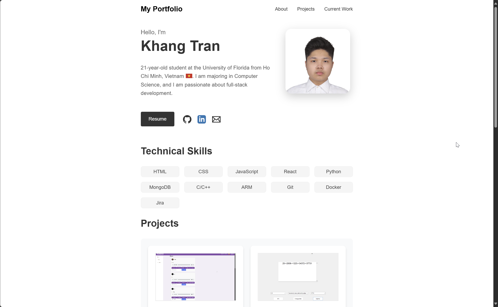

# Personal Portfolio Website 🌐

Welcome to the repository for my **Personal Portfolio Website**! This project showcases my skills, projects, and experience as a software engineer.

  

---

## 🛠️ Features

- **About Me**: A brief introduction and overview of my background.
- **Contact**: Easy access to resume and social links.
- **Skills**: A list of technologies and tools I work with.
- **Projects**: A showcase of selected projects, including descriptions and links to project github.
- **Current Work**: A list of projects in the making.
- **Responsive Design**: Fully optimized for both desktop and mobile devices.

---

## 💻 Tech Stack

This portfolio was built using the following technologies:

- **HTML5**: Semantic and accessible structure.
- **CSS3**: Styling with modern layouts (Flexbox/Grid) and responsive design.
- **GitHub Pages**: Hosting Website.

---

## 🚀 Live Demo

Check out the live version of my portfolio here:  
[**Live Portfolio**](https://npkltacocat.github.io/Personal-Website/)  

---

## 📂 Project Structure
/
├── index.html          # Main HTML file
├── styles/             # Folder for CSS files
│   └── main.css        # Main CSS file
│       ├── base        # Folder for base CSS files
│       ├── components  # Folder for CSS components like buttons
│       ├── sections    # Folder for the different section in the page
│       └── utilities   # Folder for CSS utilities like responsive designs
├── images/             # Folder for personal and project images
├── documents/          # Folder for documents like resumes   
└── README.md           # Project documentation

---

## 🛠️ Setup & Installation

1. Clone the repository:
   ```bash
   git clone https://github.com/yourusername/your-repo-name.git
2. Navigate to the project repository:
    ```bash
    cd your-repo-name
3. Open the index.html file in your browser

---

## ✨ Future Improvements

- Add a dark mode toggle for improved user experience.
- Include a blog section to share articles or updates.
- Add a section for experience and education

---

## 📬 Contact

Feel free to reach out to me:

- **Email**: [khangtran.gnb@gmail.com](mailto:khangtran.gnb@example.com)
- **GitHub**: [https://github.com/NPKLTacocat](https://github.com/NPKLTacocat)
- **LinkedIn**: [https://www.linkedin.com/in/khang-tran-7828552ba/](https://www.linkedin.com/in/khang-tran-7828552ba/)
